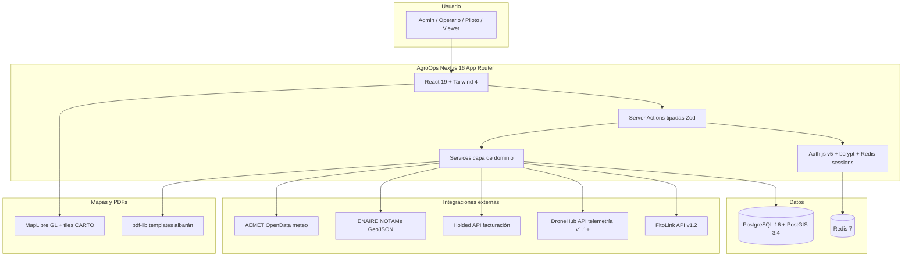

# SDD-03 — Arquitectura Técnica

## Diagrama lógico (Mermaid)

## Modelo de datos (13 tablas Drizzle, source: `src/db/schema/`)

**Identidad y RBAC**
- `users` — email, passwordHash bcrypt, role (admin/piloto/operario/viewer), active.

**Operación**
- `drones` — model (T50/Mavic 3E/D-RTK 2), serialNumber, mtomGrams, easaClass (c0–c6, n_a), applicationCapable, payloadLitres, status.
- `pilots` — nif, aesaLicenseNumber/Class/ExpiresAt, ropoQualified/ropoLevel/ropoExpiresAt, insuranceExpiresAt, flightHours.
- `clients` — name, taxId (CIF/NIF), type (agricultor/cooperativa/ATRIA/etc), contactEmail, billingAddress, holdedContactId.
- `parcels` — clientId, sigpacReference, **geometry geometry(Polygon, 4326)** con índice GIST, areaHectares, crop, cropVariety.

**Fitosanitario**
- `phytosanitary_products` — commercialName, activeIngredient, mapaRegistration, formulation, lotNumber, expiresAt, recommendedDoseValue/Unit, safetyPeriodDays, active.
- `treatment_plans` — clientId, parcelId, season, crop, plannedTreatments (JSONB array).

**Misiones (state machine 8 estados)**
- `missions` — code `AGM-YYYY-NNNN`, type (`aerial_application`), status (`draft → planned → approved → preflight → in_flight → completed → invoiced` | `cancelled`), clientId, pilotId, droneId, **nptaReference** (hardcoded `NPTA-DROVINCI-2026` por ADR-5), scheduledAt, startedAt, completedAt, areaPlannedHa, areaTreatedHa, weatherSnapshot (JSONB), telemetry (JSONB GeoJSON).
- `mission_parcels` — junction M:M (mission ↔ parcel) con areaTreatedHa por parcela.
- `mission_phyto` — productos aplicados por misión con dosis, lote y área cubierta (M:M con atributos).

**Evidencia y facturación**
- `albarans` — code `ALB-YYYY-NNNN`, missionId (1:1), signedAt, signerFullName/nif, signatureImageBase64 PNG, pdfPath, pdfHash SHA-256.
- `invoices_ref` — missionId, holdedInvoiceId/Number/Url, amount, currency, status (pending/issued/paid/cancelled/error), issuedAt, paidAt, errorMessage. Holded es source-of-truth (ADR-6).

**Auditoría**
- `audit_log` — userId, action (`entity.verb`), entityType, entityId, before/after (JSONB), metadata, ipAddress, userAgent, createdAt. Append-only.

**Enums:** userRole, droneStatus, droneEasaClass, missionType, missionStatus, clientType, doseUnit, invoiceStatus.

**Extensiones Postgres cargadas:** postgis 3.4.3, postgis_topology, pg_trgm, unaccent, plpgsql.

## Flujo principal — Misión completada con éxito

1. **Borrador (`draft`)** — Operario crea misión, selecciona cliente, parcelas, dron, piloto. Sin validaciones gates.
2. **Planificada (`planned`)** — Validación: parcelas geometría OK, dron application_capable, piloto ROPO+AESA vigentes, seguro vigente, no solape de agenda.
3. **Aprobada (`approved`)** — Admin u operario aprueba (RBAC server-side).
4. **Preflight (`preflight`)** — Captura `weatherSnapshot` desde AEMET (viento, lluvia, temp, humedad). Valida ventana segura. Consulta NOTAMs ENAIRE en la zona.
5. **En vuelo (`in_flight`)** — `startedAt = now()`. Piloto arranca operación.
6. **Completada (`completed`)** — Captura `telemetry` (GeoJSON FeatureCollection del DroneHub o manual), `areaTreatedHa`. Cliente firma albarán en finca (canvas → PNG base64 → PDF pdf-lib → hash SHA-256). `completedAt = now()`.
7. **Facturada (`invoiced`)** — Trigger creación factura Holded → guardar referencia en `invoices_ref`. Sync periódico de estado (pending → issued → paid).

`cancelled` puede ocurrir desde cualquier estado, registra motivo.

## Integraciones externas (3 stubs en `src/server/integrations/`)

- **AEMET** (`aemet.ts`) — POST a `https://opendata.aemet.es/`. Implementación real en HU-13.
- **ENAIRE** (`enaire.ts`) — GET feed NOTAMs, parse GeoJSON, cache Redis < 15 min. Implementación real en HU-12.
- **Holded** (`holded.ts`) — POST `/documents/invoice`, GET sync. Implementación real en HU-18/19/20.

## Seguridad

- **TLS** delegado a Caddy en producción.
- **Sesiones** Auth.js v5 en Redis (ADR-7).
- **RBAC chequeado en server** (regla no negociable del CLAUDE.md).
- **Audit log** para toda mutación crítica.
- **Sin secretos en código.** `.env.local` gitignorado.
- **Backups encriptados** off-site (S3-compatible, GPG) — ADR-9.
