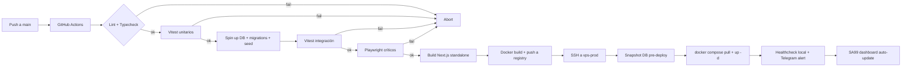

# SDD-08 — Plan de Despliegue

## Filosofía

- **Sin staging.** Coherente con flujo "Interno/crítico" del Catálogo de Infraestructura SRS (igual que SA99 y Vigía): Mac local → push a `main` → CI verde → deploy automático a PROD.
- Justificación: single-tenant per deployment (ADR-2) + operador único (AgroM) + ciclo corto + Identity Sprint controla la calidad visual antes de declarar pantalla "lista".

## Infraestructura asignada (SRS offset +170)

| Capa | Local Mac Mini (bleu) | PROD VPS |
|---|---|---|
| Frontend Next.js 16 | `127.0.0.1:3170` (con `next dev -p 3170` cuando se ajuste el package.json) | container `agroops-frontend` detrás de Caddy |
| API route handlers | mismo proceso que frontend (`4170` reservado) | mismo proceso, reservado para split futuro |
| Internal/workers | `127.0.0.1:5170` reservado | reservado |
| PostgreSQL 16 + PostGIS 3.4 | `127.0.0.1:6170` (container `agroops-postgres`) | container `agroops-postgres` |
| Redis 7 | `127.0.0.1:6171` (container `agroops-redis`) | container `agroops-redis` |
| Dominio | `localhost:3170` | `agroops.agrom.es` (DNS Hostinger A → 72.62.41.234) |
| TLS | n/a | Caddy + Let's Encrypt automático |

## Stack productivo

- **Caddy** como reverse proxy + SSL automático (Let's Encrypt). Coherente con SRS standard (Nginx en otros proyectos; Caddy admitido por su SSL out-of-the-box).
- **Docker Compose** orquestando los 3 containers (`agroops-frontend`, `agroops-postgres`, `agroops-redis`).
- **GitHub Actions** para CI/CD (lint + typecheck + tests + build + deploy).

## Pipeline

## Disciplina pre-merge

- 0 errores TS (`pnpm tsc --noEmit`).
- 0 ESLint errors (`pnpm eslint . --max-warnings 0`).
- Vitest + Playwright críticos verdes.
- Migraciones reversibles (test específico).
- Cobertura services.ts ≥ 80%.

## Backups (ADR-9)

- **Frecuencia:** diaria a las 03:00 UTC.
- **Contenido:** dump completo Postgres (`pg_dump`) + manifest de PDFs de albaranes.
- **Encriptación:** GPG con clave pública AgroM.
- **Destino:** Backblaze B2 o Hetzner Storage Box (S3-compatible).
- **Retención:** 30 días daily, 12 meses monthly.
- **Restore probado:** mensual obligatorio. Si no se prueba, el backup es ficción.
- **Scripts:** `scripts/backup.sh` y `scripts/restore.sh` (referenciados en el Makefile del bundle, implementación pendiente).

## Monitoring

- **Healthcheck SRS** (cron 5 min) verifica los 3 containers UP.
- **Telegram bot SA99** alerta caídas, dedupe 30 min.
- **SA99 InfraService** (`db.servers.updateOne({_id: "vps-prod"}, {$set: {"projects.AgroOps": {containers: [...], domain: "agroops.agrom.es"}}})`) registra el proyecto al deploy.
- **Compresión HTTP obligatoria** (gzip + brotli en Caddy, estándar SRS desde v1.6 del Manifiesto). Métrica de reducción a registrar aquí cuando se publique el endpoint más pesado.

## Estándares operacionales obligatorios

Cumplir el Manifiesto SDD-SRS:

- **gzip + brotli** activos en Caddy (Caddy lo trae out-of-the-box, sólo configurar).
- **Anti-pattern silent .catch en datos críticos** (Manifiesto v1.7): cualquier integración (AEMET, ENAIRE, Holded) debe refuse-to-cache si la fuente crítica falla, no envenenar cache con falso negativo.
- **Compresión registrada en SDD-08 post-deploy**: endpoint más pesado, % reducción.

## Variables de entorno (referencia, ver `.env.example`)

- `DATABASE_URL`, `REDIS_URL` (locales: 6170 y 6171; PROD: lo que corresponda).
- `AUTH_SECRET`, `AUTH_URL` (`https://agroops.agrom.es` en PROD).
- `AEMET_API_KEY`, `ENAIRE_NOTAM_FEED`.
- `HOLDED_API_KEY`, `HOLDED_BASE_URL`.
- `DRONEHUB_API_KEY`, `DRONEHUB_BASE_URL`.
- `TELEGRAM_BOT_TOKEN`, `TELEGRAM_CHAT_ID`.
- `SA99_REGISTRATION_KEY`, `SA99_BASE_URL`.
- `BACKUP_S3_ENDPOINT`, `BACKUP_S3_BUCKET`, `BACKUP_S3_ACCESS_KEY`, `BACKUP_S3_SECRET_KEY`, `BACKUP_GPG_RECIPIENT`.

## Rollback

- **Manual:** rollback de container al tag anterior, restore de DB desde snapshot pre-deploy.
- **Triggers:** healthcheck rojo > 10 min, error rate > 5%, manual decision.
- **RTO objetivo:** 30 min.
- **RPO objetivo:** 24h (último backup).

## Pendientes pre-PROD

- [ ] DNS `agroops.agrom.es` en Hostinger.
- [ ] Cuenta Holded activa con API key.
- [ ] Backup script real (`scripts/backup.sh`) con encriptación GPG.
- [ ] Cron en VPS para backup diario.
- [ ] Registro SA99 vía MongoDB update (ver Plantilla Kickoff Fase 6).
- [ ] Identity Sprint cerrado + Distinctiveness Audit aprobado (los 12 puntos).
- [ ] Reportar métrica de compresión del endpoint más pesado.

---

## Historial

- **v0.1 (11 may 2026):** plan inicial. Sin staging coherente con flujo Interno/crítico. Offset +170 reservado. Identity Sprint y Distinctiveness Audit son gates pre-PROD.
